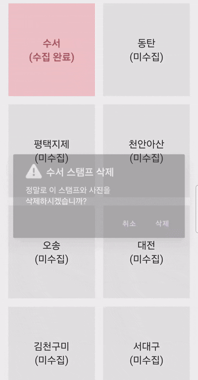
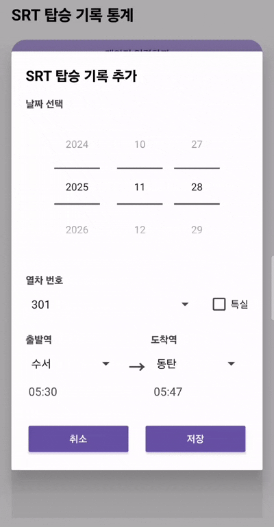
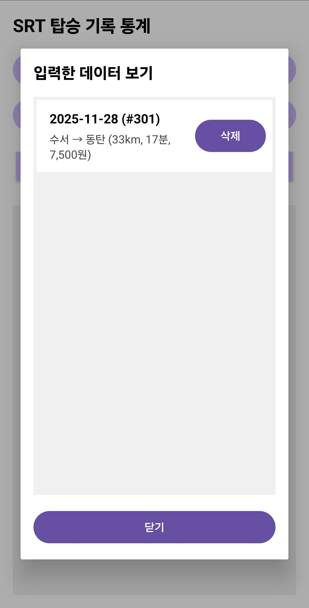
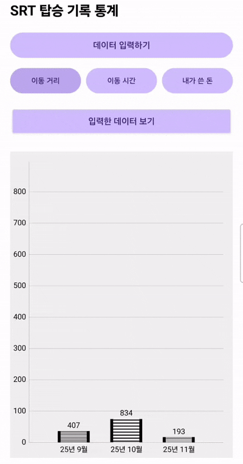

# Stamp Rally Train (SRT 스탬프 랠리)  

**Stamp Rally Train**은 SRT를 자주 이용하는 사람들을 위한 안드로이드 앱입니다. GPS를 이용해 역에 도착하여 스탬프를 수집하고 사진을 찍어 추억을 간직할 수 있는 **스탬프 랠리** 기능과, 탑승 기록을 저장하여 월별 이동 거리, 시간, 요금을 시각화된 차트로 보여주는 **탑승 기록 및 통계 서비스**를 제공합니다.

---

## 목차
* [주요 기능](#주요-기능)
* [사용법](#사용법)
* [프로젝트 구조](#프로젝트-구조)
* [Reference](#reference)
* [License](#license)
---
 
## 주요 기능

### 1. 스탬프 랠리
* **GPS 위치 기반 인증 :** 사용자의 실시간 위치를 추적하여 SRT 역 100m 이내에 도착 시 스탬프를 찍을 수 있는 기능이 활성화됩니다.
* **스탬프와 사진 획득 :** 역에 도착하여 스탬프를 클릭하면 카메라 기능이 활성화 되어 SRT 역을 찍을 수 있습니다. 추억을 간직해 보세요!
* **사진 삭제 :** 찍은 사진이 마음에 들지 않는다면 스탬프를 길게 눌러 삭제해보세요!

### 2. 탑승 기록 및 통계
* **탑승 기록 :** 날짜, 열차 번호, 출발역, 도착역, 특실 여부를 선택하여 탑승 기록을 추가합니다.
* **데이터 계산 :** 출발/도착역 선택 시 소요 시간, 이동 거리, 운임 요금이 내장된 데이터베이스를 통해 자동으로 계산됩니다.
* **월별 통계 그래프 :** `MPAndroidChart` 라이브러리를 활용하여 월별 데이터를 그래프로 시각화합니다.
    * **이동 거리 (km) :** 레일 이미지 그래프
    * **이동 시간 (분) :** 기차 이미지 그래프
    * **지출 요금 (원) :** 지폐 이미지 그래프
* **데이터 조회 :** 저장된 과거 탑승 내역을 리스트 형태로 조회하고 개별 삭제가 가능합니다.

### 3. 데이터 관리
* **SQLite 데이터베이스:** 모든 스탬프 획득 현황과 사용자 탑승 기록은 앱 내부의 SQLite DB(`Stamps.db`)에 저장됩니다.

---

## 사용법

### 1. 스탬프 랠리
 
SRT 역으로부터 100m 이내에 도착하면 사진과 같이 스탬프가 **초록색**으로 활성화됩니다. 이때 스탬프를 클릭할 시 카메라 기능이 활성화 되고 SRT 역을 촬영할 수 있습니다. 잘 촬영해보세요! 사진을 찍었다면 스탬프가 **빨간색**이 됩니다. 이는 스탬프를 잘 수집했다는 의미입니다. 빨간색 스탬프를 클릭하면 전에 찍었던 사진을 다시 볼 수 있습니다. 

 
만약 사진이 마음에 들지 않으면 스탬프를 길게 눌러 삭제할 수 있지만 스탬프도 같이 삭제되니 신중하게 삭제해주세요!

### 2. 탑승 기록 및 통계
 
**데이터 입력하기** 버튼을 클릭하면 사진과 같은 팝업 창이 나타납니다. **탑승한 날짜**를 선택하고 **열차 번호**를 선택합니다. 열차 번호를 선택했으면 **출발역**과 **도착역**을 선택 후 특실을 탑승했다면 **특실** 여부를 체크한 후 **저장** 버튼을 누릅니다.

 
**입력한 데이터 보기** 버튼을 클릭하면 지금까지 입력한 데이터를 볼 수 있습니다. 만약 잘못 입력한 데이터가 있으면 **삭제** 버튼을 눌러 삭제할 수 있습니다.

 
**이동 거리**, **이동 시간**, **내가 쓴 돈** 버튼을 클릭하면 **데이터 입력하기** 버튼을 통해 입력했던 SRT 탑승 정보에 대한 월별 통계를 시각화해서 보여줍니다.

---

## 프로젝트 구조

~~~text
<JAVA>
MainActivity.java
  - 앱 실행 시 가장 먼저 실행되는 파일
ViewPagerAdapter.java
  - 스탬프 탭과 탑승 기록&통계 탭 간 전환 관리
Stamp.java
  - 역의 좌표와 TextView를 매핑하여 Station 객채로 관리
  - DB에서 이미 획득한 스탬프 정보 가져와 초기 상태 설정
  - GPS를 통해 사용자가 설정된 값 이내로 역 근처에 도착하면 스탬프를 활성화
  - 활성화 된 스탬프를 클릭하면 카메라 활성화, 촬영 후 이미지를 리사이징 후 회전 정보를 보정하여 사진을 저장
  - 획득한 스탬프를 짧게 누르면 저장된 사진을 보여주고, 길게 누르면 삭제 여부를 묻는 문구를 보여준 후 사진을 삭제
Statistics.java
  - 팝업창을 띄워 탑승 정보를 입력받음
  - 날짜를 선택하면 해당 요일에 운행하는 열차 번호만 필터링
  - 열차 번호를 선택하면 해당 열차의 정차역만 출발역 목록에 뜨도록 필터링
  - 출발역을 선택하면 그 이후의 역만 도착역 목록에 뜨도록 필터링
  - 선택하면 필터링된 정보가 스피너 창에 자동으로 업데이트
  - 입력 정보를 바탕으로 SrtData, SrtDataFare를 호출하여 이동 거리, 시간, 요금을 계산하여 저장
  - DB에서 월별 통계 데이터를 가져온 후 그래프에 바인딩 후 사용자가 누른 버튼에 따라 다른 데이터, 그림을 적용하여 그래프를 다시 그림
  - 저장된 모든 탑승 기록을 리스트 형태로 보여주며 삭제 기능 제공
ImageChart.java
  - 그래프에 이미지를 삽입하기 위한 파일
  - bitmap 이미지를 그래프에 맞춰 그림
Srt.java
  - 탑승 기록 한 건을 나타내는 객체
SrtListAdapter.java
  - Srt 객체 리스트를 받아 saved_info.xml 레이아웃에 데이터를 바인딩 후 삭제 버튼을 누르면 콜백 인터페이스를 통해 Statistics 프래그먼트에 삭제 이벤트 전달
Database.java
  - SQLiteOpenHelper를 상속받음
  - stamps : 역이름, 이미지 파일 경로 저장
  - srt_user_trips : 날짜, 열차번호, 출발역, 도착역, 시간, 거리, 요금 저장
SrtData.java
  - 열차 번호 별 정차역과 도착시간, 거리, 운행요일에 대한 정보
  - 두 역 객체를 입력받아 도착 시간의 차이와 누적 거리의 차이를 계산
SrtFareData.java
  - 출발역과 도착역, 특실 여부에 따라 달라지는 요금에 대한 정보

<XML>
activity_main.xml
  - 메인 화면 레이아웃
design_stamp.xml
  - 스탬프 화면
design_statistics.xml
  - 탑승 기록 & 통계 화면
popup_add_srt_info.xml
  - 탑승 기록 입력을 위한 팝업창
saved_info.xml
  - 탑승 기록 리스트의 단일 항목
saved_info_list.xml
  - 기록 조회를 위한 팝업창
~~~

---

## Reference

* [MPAndroidChart](https://github.com/PhilJay/MPAndroidChart) : 탑승 기록을 시각화하기 위해 사용했습니다.

---

## License

* 이 프로젝트는 [MIT LICNESE](LICENSE)를 따릅니다
